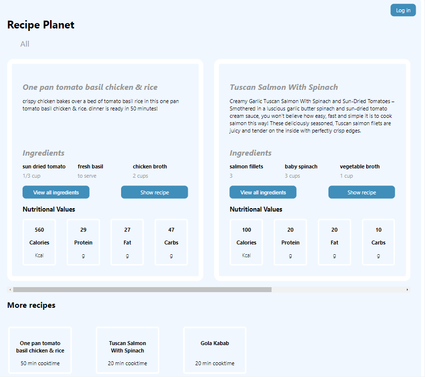

# Recipe Planet Application

[View App](https://recipe-planet.herokuapp.com/)

The Application consumes data from a strapi API which was deployed on heroku.

The Application was build mainly for tablet and desktop.

## Description
Recipe Planet application is an app for viewing recipes, the user can choose among different categories.

For example between
* Chicken
* Fruits
* Chinese
* Mexican
 etc..

Clicking on show ingredients, will show a modal with all the ingredients. 

Clicking on show recipe, will take you to the single view of that recipe.
